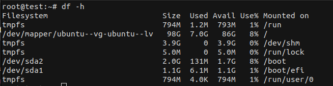
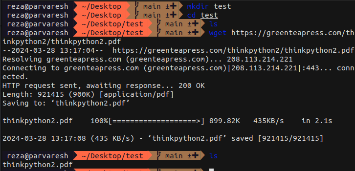
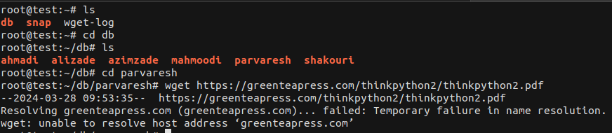

# گزارش کامل از سرور لینوکسی مستفر در پژوهشگاه

# فهرست 


۱. [راه اندازی](#راه_اندازی)

۲. [مشخصات فنی](#مشخصات_فنی)

۳. [دانلود داده](#دانلود_داده)

۴. [نتیجه گیری](#نتیجه_گیری)


#  راه_اندازی
  
برای اتصال به سرور میبایست از پروتکل SSH  استفاده کرد.
 SSH (Secure Shell) راهی امن برای اتصال و برقراری ارتباط با کامپیوتر  های راه دور از طریق اینترنت است. این داده ها را برای جلوگیری از دسترسی غیرمجاز رمزگذاری می کند و می تواند برای ورود از راه دور، انتقال فایل و ایجاد تونل های امن برای اتصالات شبکه استفاده شود. به طور خلاصه، ارتباط امن و خصوصی بین رایانه‌ها از طریق شبکه‌های بالقوه ناامن را تضمین می‌کند.

 کامند اتصال به شرح زیر میباشد.


```bash
ssh username@server_ip
```


که ما به صورت زیر به سرور وصل میشویم

در این مرحله  رمز ان وارد شده است.


```bash
reza@parvaresh ~  main ±✚  ssh root@185.130.78.99
root@185.130.78.99's password: 
Welcome to Ubuntu 22.04.3 LTS (GNU/Linux 5.15.0-78-generic x86_64)

 * Documentation:  https://help.ubuntu.com
 * Management:     https://landscape.canonical.com
 * Support:        https://ubuntu.com/advantage

  System information as of Thu Mar 28 08:23:54 AM UTC 2024

  System load:  0.0               Processes:              209
  Usage of /:   7.1% of 97.87GB   Users logged in:        1
  Memory usage: 4%                IPv4 address for ens34: 172.20.81.99
  Swap usage:   0%


Expanded Security Maintenance for Applications is not enabled.

0 updates can be applied immediately.

Enable ESM Apps to receive additional future security updates.
See https://ubuntu.com/esm or run: sudo pro status


The list of available updates is more than a week old.
To check for new updates run: sudo apt update
Failed to connect to https://changelogs.ubuntu.com/meta-release-lts. Check your Internet connection or proxy settings


Last login: Wed Mar 27 09:56:25 2024 from 37.129.102.254
root@test:~# 


```


# مشخصات_فنی
با کامند زیر اطلاعات مربوط به فضای ذخیره سازی میگیریم: 


```bash
df -h
```


به طور خلاصه، دستور 'df -h' در لینوکس برای نمایش فضای استفاده شده از دیسک در قالبی قابل خواندن توسط انسان استفاده می شود. در اینجا یک تفکیک وجود دارد:

- **df**:

 مخفف "disk free" و دستوری است که برای پرس و جو از آمار استفاده از دیسک در سیستم های لینوکس استفاده می شود.

- **-h**:

 این گزینه ای است که مخفف عبارت Human-readable است. هنگامی که با «df» استفاده می‌شود، با نمایش اندازه‌ها در قالبی قابل فهم‌تر، خروجی را به گونه‌ای قالب‌بندی می‌کند که خواندن آن برای انسان آسان‌تر باشد (به عنوان مثال، استفاده از واحدهایی مانند «K» برای کیلوبایت، «M» برای مگابایت، «G» "برای گیگابایت و غیره).

خروجی «df -h» معمولاً از چندین ستون تشکیل شده است:

---

1. **Filesystem**: 

این ستون نام فایل سیستم یا پارتیشن را نمایش می دهد.

2. **Size**:

اندازه کل حجم فایل سیستم را نشان میدهد.


3. **use**: 

این نشان می دهد که چه مقدار از فایل سیستم در حال حاضر در حال استفاده است.

4. **Avail**:

 مقدار فضای موجود در فایل سیستم را برای داده های اضافی نمایش می دهد. این فضایی است که می توانید برای ذخیره فایل های جدید استفاده کنید.

5. **Use%**: 

این ستون نشان دهنده درصد فضای استفاده شده نسبت به حجم کل فایل سیستم است.

6. **Mounted on**: 


فهرستی که فایل سیستم در آن نصب شده است را نشان می دهد.


که خروجی أن به شرح زیر است :‌ 





برای یک بخش مهم است که تفسیر ان در زیر نوشته شده است.
/dev/mapper/ubuntu--vg-ubuntu--lv نام دستگاه حجم منطقی است که سیستم فایل ریشه را نشان می دهد.

- 98G اندازه کل این پارتیشن است.

- 7.0G مقدار فضایی است که در حال حاضر استفاده می شود.

- 86G مقدار فضای موجود است.

/ نشان می دهد که این پارتیشن به عنوان فایل سیستم ریشه نصب شده است.


اینجا جایی است که بیشتر فایل های سیستم، برنامه ها و داده های کاربر به صورت پیش فرض ذخیره می شوند. بنابراین، پارتیشن اصلی است که برای نصب برنامه ها و ذخیره داده ها در این سیستم استفاده می شود.


<b>بنابراین با توجه به حجم داده ها بهتر است فضای دخیره سازی افزایش یابد.</b>


# دانلود_داده


برای دانلود داده ها از کامند زیر استفاده میکنیم.


```bash

wget https://example.com 

```


ابتدا برای مثال یک کتاب را از یک سیستم متصل به اینترنت دانلود کرده که یک پوشه درست کرده و سپس در انجا اقدام به دانلود کرده :‌ 




به وضوح میتوان دید که فایل دانلود شده است.
حالا که از صحیح بودن لینک بااطمینان حاصل کردیم میتوان همین کار را بر سرور انجام داد.





با اروربالا مواجه شده که به تفسیر ان پرداخته‌: 

این ارور "Temporary failure in name resolution" به مشکلاتی در فرآیند رزولو کردن نام ارائه دهنده سرویس اینترنت (DNS) اشاره دارد. این ممکن است به علت چند علت مختلف اتفاق بیافتد، از جمله:

۱. **مشکل در تنظیمات شبکه**: 

اگر تنظیمات شبکه سرور درست تنظیم نشده باشد، این مشکل رخ می‌دهد. مطمئن شویم که تنظیمات شبکه (مانند DNS) درست تنظیم شده باشند.

۲. **فایروال**: 

ممکن است فایروال سرور باعث ایجاد مشکلات در رزولو کردن نام ارائه دهنده سرویس DNS شود. فایروال‌ها معمولاً برای محافظت از شبکه‌ها و سیستم‌ها در برابر حملات و دسترسی‌های غیرمجاز استفاده می‌شوند و می‌توانند

۳. **مشکل در سرور DNS**:

 ممکن است سرور DNS  مشکل داشته باشد یا  DNS مورد استفاده سرور قادر به رزولو کردن نام‌ها نباشد. 


برای رفع این مشکل، می‌توانید اقدامات زیر را انجام دهیم:

- بررسی تنظیمات شبکه سرور  اطمینان حاصل کنیم که DNS مورد استفاده شده  درست تنظیم شده باشد.


# نتیجه_گیری

به صورت کلی برای استفاده از این سرور باید اقدامات زیر صورت گیرد.

۱. افزایش حجم از ۹۸ گیگ به حجم بیشتر جهت ذخیره سازی داده ها.


۲. بررسی تنظیمات شبکه سرور جهت دانلود و ذخیره سازی داده ها


با تشکر - علیرضا پرورش


